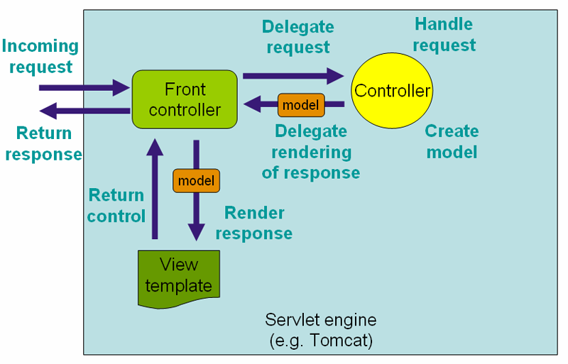

# Read Spring Framework Document - web part

---


## 22. Web MVC framework

- [X] [22.1 Introduction to Spring Web MVC framework](http://docs.spring.io/spring/docs/current/spring-framework-reference/html/mvc.html#mvc-introduction)

The Spring Web model-view-controller (MVC) framework is designed around a DispatcherServlet that dispatches requests to handlers, with configurable handler mappings, view resolution, locale, time zone and theme resolution as well as support for uploading files. The default handler is based on the @Controller and @RequestMapping annotations, offering a wide range of flexible handling methods.

开闭原则："Open for extension…​" A key design principle in Spring Web MVC and in Spring in general is the "Open for extension, closed for modification" principle.

- [X] [22.2 The DispatcherServlet](http://docs.spring.io/spring/docs/current/spring-framework-reference/html/mvc.html#mvc-servlet)

Spring MVC处理请求过程：



The WebApplicationContext is bound in the ServletContext, and by using static methods on the RequestContextUtils class you can always look up the WebApplicationContext if you need access to it.

DispatcherServlet 使用的默认bean type配置在DispatcherServlet.properties文件中。


- [ ] [22.3 Implementing Controllers]()


Spring 4.3引入的组合注解@GetMapping、@PostMapping等可以简化@RequestMapping.

Prior to Spring 3.1, type and method-level request mappings were examined in two separate stages — a controller was selected first by the DefaultAnnotationHandlerMapping and the actual method to invoke was narrowed down second by the AnnotationMethodHandlerAdapter.

With the new support classes in Spring 3.1, the RequestMappingHandlerMapping is the only place where a decision is made about which method should process the request. Think of controller methods as a collection of unique endpoints with mappings for each method derived from type and method-level @RequestMapping information.

This enables some new possibilities. For once a HandlerInterceptor or a HandlerExceptionResolver can now expect the Object-based handler to be a HandlerMethod, which allows them to examine the exact method, its parameters and associated annotations. The processing for a URL no longer needs to be split across different controllers.

URI Template Patterns实现了URI的参数化，handler中的@PathVariable绑定方法参数到URI template中的变量.当@PathVariable用于Map<String, String>类型的参数，该map会存储所有对应的URI template变量.

handler方法支持的参数类型，返回值类型很丰富.


- [X] [22.4 Handler mappings](http://docs.spring.io/spring/docs/current/spring-framework-reference/html/mvc.html#mvc-handlermapping)

RequestMappingHandlerMapping automatically looks for @RequestMapping annotations on all @Controller beans. However, do keep in mind that all HandlerMapping classes extending from AbstractHandlerMapping have the following properties that you can use to customize their behavior: interceptors, defaultHandler ,order ,urlDecode .

使用HandlerInterceptor拦截请求，HandlerInterceptorAdapter makes it easier to extend the HandlerInterceptor interface.

使用下面方式配置interceptor没有生效：

```xml
<bean id="handlerMapping"
          class="org.springframework.web.servlet.mvc.method.annotation.RequestMappingHandlerMapping">
        <property name="interceptors">
            <list>
                <ref bean="officeHoursInterceptor"/>
            </list>
        </property>
    </bean>

    <bean id="officeHoursInterceptor"
          class="com.vonzhou.learn.interceptor.TimeBasedAccessInterceptor">
        <property name="openingTime" value="9"/>
        <property name="closingTime" value="18"/>
    </bean>
```

而是用：

```xml
<mvc:interceptors>
        <mvc:interceptor>
            <mvc:mapping path="/office/home"/>
            <bean class="com.vonzhou.learn.interceptor.TimeBasedAccessInterceptor">
                <property name="openingTime" value="9"/>
                <property name="closingTime" value="18"/>
            </bean>
        </mvc:interceptor>
    </mvc:interceptors>
```


- [ ] [22.5 Resolving views]()


- [ ] [22.11 Handling exceptions](http://docs.spring.io/spring/docs/current/spring-framework-reference/html/mvc.html#mvc-exceptionhandlers)

使用@ExceptionHandler.

DefaultHandlerExceptionResolve负责把Spring MVC异常转成特定的状态码.


- [ ] [22.13 Convention over configuration support](http://docs.spring.io/spring/docs/current/spring-framework-reference/html/mvc.html#mvc-coc)


- [ ] [22.14 HTTP caching support](http://docs.spring.io/spring/docs/current/spring-framework-reference/html/mvc.html#mvc-caching)

CacheControl可以用来设置Cache-Control指令.

Static resources should be served with appropriate 'Cache-Control' and conditional headers for optimal performance.


22.15 Code-based Servlet container initialization


22.16 Configuring Spring MVC


